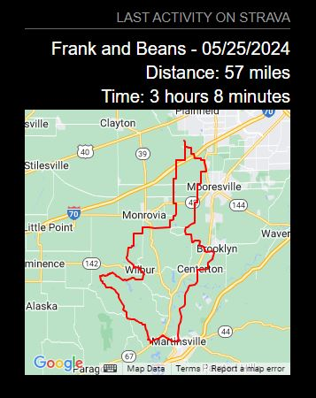

# MMM-Strava-Last-Activity-Map

---

A simple magic mirror module for displaying a map of the last activity.  


## Table of contents

1. [Setup](#setup)
2. [Configuration](#configuration)
3. [Updates](#updates)

## Setup

-In order to run the module, you'll need to [setup API access](https://developers.strava.com/docs/getting-started/#account) on your Strava account.

-You'll need to get your clientId, clientSecret, and initial refreshToken. Follow [these instructions](https://developers.strava.com/docs/getting-started/#oauth) to get those values.
-Scopes for the token should include: activity:read_all

-You'll need to get a Google Maps API key. Follow [thesee instructions](https://developers.google.com/maps/documentation/javascript/adding-a-google-map#key)

- If the module does not appear to work, check the console by running your MM with dev tools (npm start dev).

- Note: The access token and refresh tokens are kept in a file in the directory above the module. This is for the case where you are running both of my Strava MM modules, they'll share the token data between them allowing them to stay in sync and avoid "Unauthorized" errors

## Configuration

```json
	{
			module: "MMM-Strava-Last-Activity-Map",
			position: "top_right",
			config: {
				stravaClientId: "[YOUR CLIENT ID]",
				stravaClientSecret: "[YOUR CLIENT SECRET]",
				stravaRefreshToken: "[YOUR REFRESH TOKEN]",
				googleMapsApiKey: "[YOUR GOOGLE MAPS API KEY]",
				mapTypeId: "roadmap",
				styledMapType: "standard",
				disableDefaultUI: true,
				header: "Last Activity on Strava",
				height: "300px",
				width: "300px",
				initialLoadDelay: 4250,
				retryDelay: 2500,
				updateInterval: 60 * 15 * 1000,
			}
		},
```

## Updates

I will likely continue to update the module. When you see that an update is available:

1. Open the command prompt and change to directory \MagicMirror\modules\MMM-Strava-Last-Activity-Map\
2. Run command `git pull`
3. Restart the Magic Mirror
